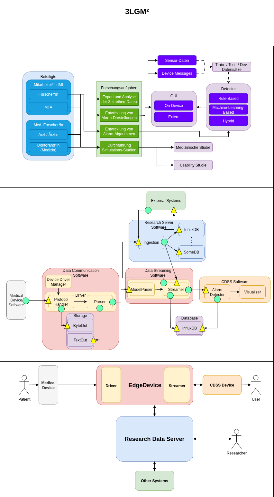
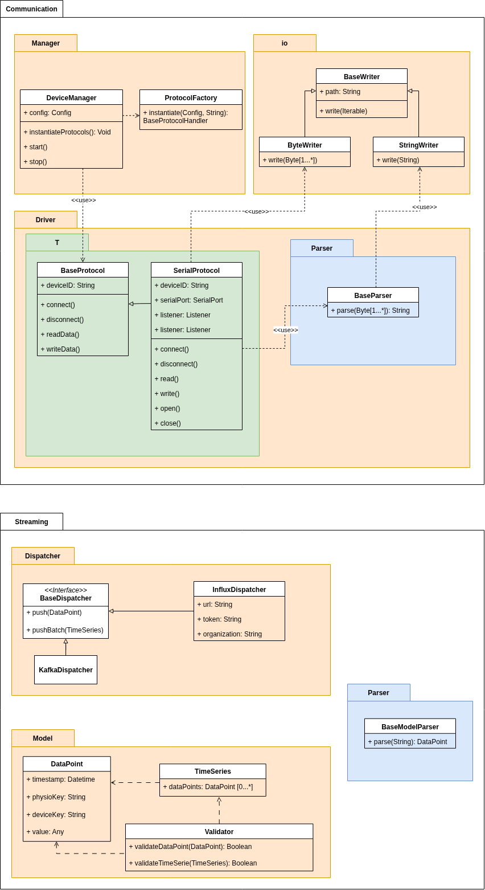

# Safety-Box

## What is the Safety-Box
The Safety-Box is a service architecture to collect data from multiple sources.
These sources can be medical-devices, sensors, etc.
The architecture is designed highly modular to be deployed either on a single edge device, or on a distributed setup.
Asynchronous computation is supported by an EventBus component.

## Getting started

### Compatibility
The following devices / protocols are supported by default:
- Medibus.X (Draeger devices)
- PC60FW Pulse-Oximeter (BLE device)

### Safety-Box Configuration
Adapt the config.json to run the Safety-Box services you need.
The config consists of 4 sections:
1. devices
2. writers
3. parsers
4. dispatchers

Each section defines the classes of that type that shall be initialized by the factory.
Define a class for the factory as follows:
```json
{
  "class": "com.safety_box.package.your.class.here",
  "id": "Some Unique Class Identifier",
  "someArgument": "value",
  ...
}
```
Including all arguments of the classes' constructor. See the default config.json for examples.

### Adding your own device
To add a device, you will need to implement the Protocol class and the Parser class for that device.
Handle the dataflow via the EventBus Architecture (cf. Architecture).

### Building
To launch the tests:

```bash
./mvnw clean test
```

To package the safety-box:

```bash
./mvnw clean package
```

To run the safety-box:

```bash
./mvnw clean compile exec:java
```

### Optional BLE Dependency
#### BlueZ
Install bluez and dbus (refer to [ubuntuusers e.V.](https://wiki.ubuntuusers.de/Bluetooth/Einrichtung/)):

```bash
sudo apt-get install bluez bluez-cups bluez-obexd
```

Verify Bluetooth service is running:

```bash
systemctl status bluetooth.service
```

#### Doxygen
```bash
sudo apt-add-repository universe
sudo apt-get update
sudo apt-get install doxygen
```

#### TinyB

Clone TinyB from the official GitHub Repository:

`git clone https://github.com/intel-iot-devkit/tinyb.git`

Navigate to the repository and install TinyB:
```
mkdir build
cd build
cmake ..
make
make install
```

## Usage
Use examples liberally, and show the expected output if you can. It's helpful to have inline the smallest example of usage that you can demonstrate, while providing links to more sophisticated examples if they are too long to reasonably include in the README.

## Architecture
### 3LGM² Design

### Model Diagram (WIP)

### EventBus Schema

## Support
Ask me.

## Roadmap
There are more default protocols to come!
Also, we are at the state of developping an Alarm-CDSS on top of the data gathering layer (cf. Architecture).
## Contributing
do it!
## Authors and acknowledgment
todo
## License
todo
## Project status
Just started.
