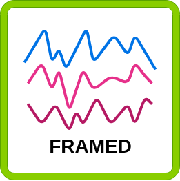
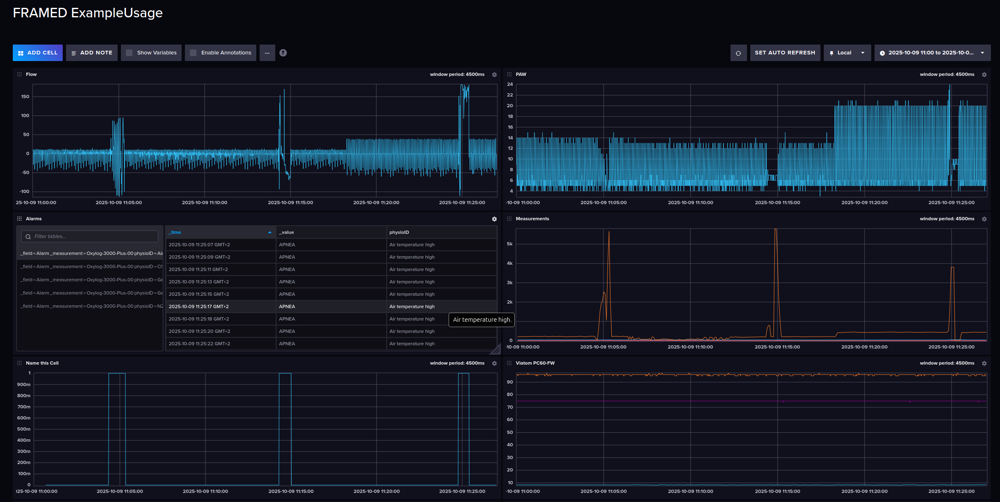
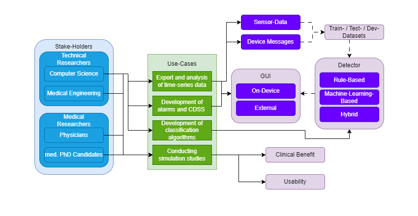
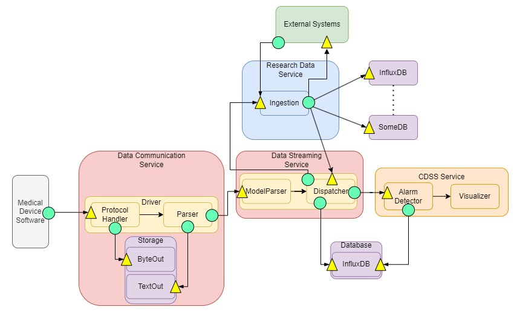
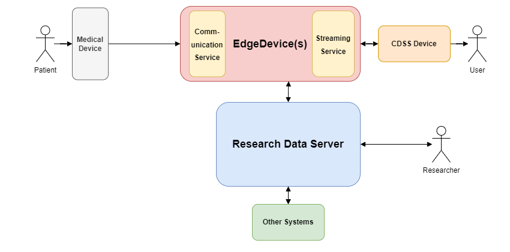
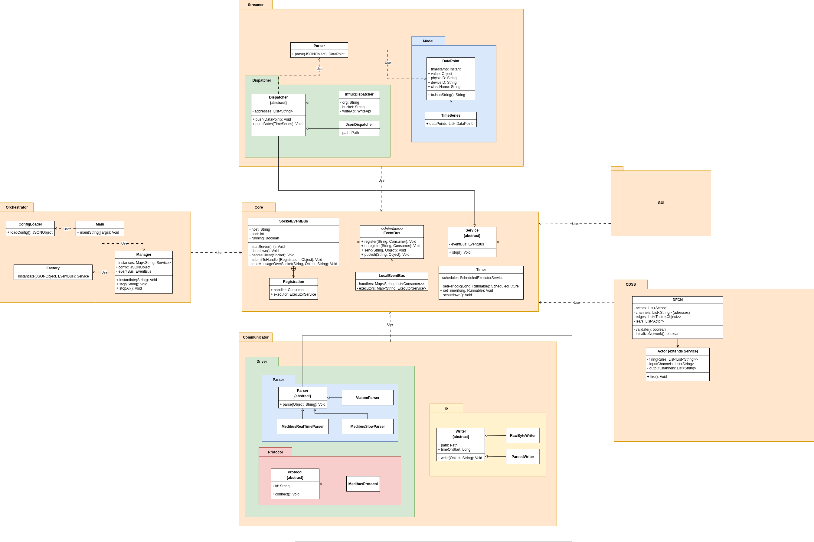
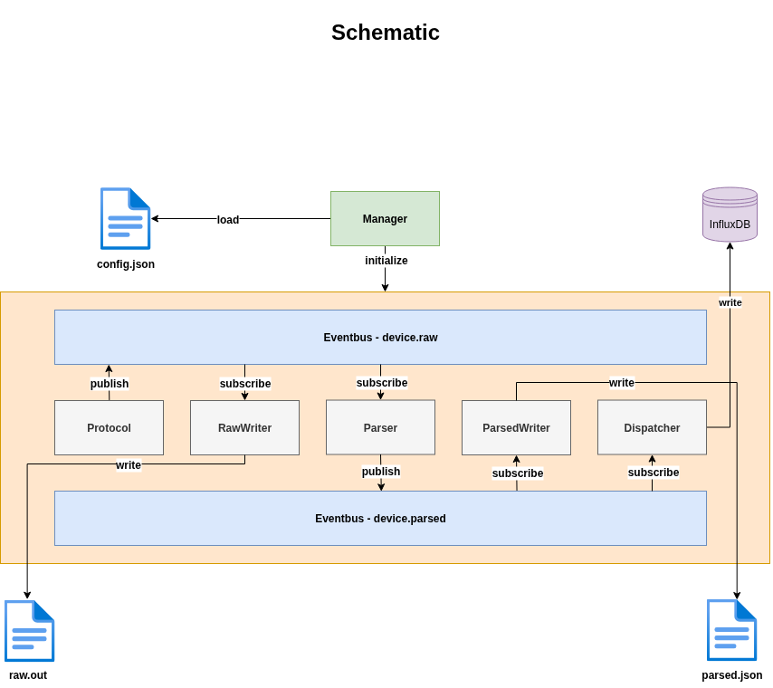

# FRAMED

A **F**ramework for **R**ealtime **A**bstraction of **M**edical **E**vent **D**ata

## What is FRAMED 🖼️?
FRAMED is a service oriented software framework to acquire and integrate data from multiple sources.
These sources can be medical-devices, sensors, etc.
The architecture is designed highly modular to be deployed either on a single edge device, or on a distributed setup.
Asynchronous computation and communication between services is supported by a SocketEventBus.

## Getting started 🎬

### Compatibility 🔌
FRAMED is written in Java and tested on Ubuntu 24.04. It should work cross-platform.
If platform specific bugs occur, please refer to (TODO contributing.md)

The following devices / protocols are supported by default:
- Medibus (Draeger devices, tested with Oxylog 3000 Plus)
- PC60FW Pulse-Oximeter (BLE device, external python service (TODO: Reference link))

Further, the default setup includes an InfluxDB and a JSONLines dispatcher to store the acquired data.
An external python service may be used to annotate data streams online (TODO: Reference link)

### FRAMED Configuration 👩‍🔧
Adapt the services.json config file to run the FRAMED services you need.
The config consists of 4 default sections:
1. devices
2. writers
3. parsers
4. dispatchers

Each section defines the classes of that type that shall be initialized by the factory.
Define a class for the factory as follows:
```json
{
  "class": "com.framed.package.your.class.here",
  "id": "Some Unique Class Identifier",
  "someArgument": "value",
  ...
}
```
Including all arguments of the classes' constructor. See the default services.json for examples.

Adapt the communication.json config file to configure the socket type, the port, and peer devices, that an instance should publish data to and subscribe data from.

```json
{
  "type": "TCP",
  "port": 4999,
  "peers": [
    {
      "host": "111.111.111.111",
      "port": "4242"
    },
    ...
  ]
}
```
See the default communication.json for example

### Adding your own device 📟
To add a device, you will need to implement the Protocol class and the Parser class for that device.
Handle the dataflow via the EventBus Architecture (cf. Architecture).

### Building 👷‍♀️
To launch the tests:

```bash
./mvnw clean test
```

To package FRAMED software:

```bash
./mvnw clean package
```

To run the FRAMED software:

```bash
./mvnw clean compile exec:java
```

### Optional BLE Dependency
#### BlueZ
Install bluez and dbus (refer to [ubuntuusers e.V.](https://wiki.ubuntuusers.de/Bluetooth/Einrichtung/)):

```bash
sudo apt-get install bluez bluez-cups bluez-obexd
```

Verify Bluetooth service is running:

```bash
systemctl status bluetooth.service
```

#### Doxygen
```bash
sudo apt-add-repository universe
sudo apt-get update
sudo apt-get install doxygen
```

### Optional InfluxDB Dependency

Refer to [influx](https://docs.influxdata.com/influxdb/v2/install/use-docker-compose/) for InfluxDBv2 Docker deployment.

## Usage ℹ️
Let's consider an example from the FRAMED Case-Study (see future paper...).
We want to receive data from:
1. The Draeger Oxylog 3000 Plus Transport Ventilator
2. The Viatom PC60-FW Fingertip Pulse-Oximeter

Further, we want to annotate events online using an additional service. In this example, all services run on a single device and are deployed by the same instance.

The services.jons file is configured:

```json
{
  "devices": [
    {
      "class": "com.framed.communicator.driver.protocol.medibus.MedibusProtocol",
      "id": "Oxylog-3000-Plus-00",
      "portName": "/dev/ttyUSB0",
      "baudRate": 19200,
      "dataBits": 8,
      "stopBits": 1,
      "bufferSize": 4096,
      "waveFormType": 1,
      "multiplier": "10",
      "realTime": true,
      "slowData": false
    }
  ],
  "writers": [
    {
      "class": "com.framed.communicator.io.raw.RawByteWriter",
      "id": "Raw-Byte-Writer",
      "devices": [
        "Oxylog-3000-Plus-00",
        "PC60FW"
      ],
      "path": "output/raw/"
    },
    {
      "class": "com.framed.communicator.io.parsed.MedibusParsedWriter",
      "id": "'Medibus-Parsed-Writer",
      "devices": [
        "Oxylog-3000-Plus-00"
      ],
      "path": "output/parsed/"
    }
  ],
  "parsers": [
    {
      "class": "com.framed.communicator.driver.parser.medibus.MedibusSlowParser",
      "id": "Medibus-Slow-Parser",
      "devices":
      [
        "Oxylog-3000-Plus-00"
      ]
    },
    {
      "class": "com.framed.communicator.driver.parser.viatom.ViatomParser",
      "id": "Viatom-Parser",
      "devices":
      [
        "PC60FW"
      ]
    },
    {
      "class": "com.framed.communicator.driver.parser.medibus.MedibusRealTimeParser",
      "id": "Medibus-RT-Parser",
      "devices":
      [
        "Oxylog-3000-Plus-00"
      ],
      "waveFormType": 1
    }
  ],
  "Dispatchers": [
    {
      "class": "com.framed.streamer.dispatcher.InfluxDispatcher",
      "bucket": "safety-box",
      "id": "InfluxDB",
      "url": "http://localhost:8086",
      "token": "ThoKiNpWG1QpK8NjBayxWiXq2vwj4L7q-0NvisFVpp-af9tt1qh8ohL00V_pRDksSKTt7hqLkOKRQ6GKxFmKzg==",
      "org": "IMI-MSE",
      "devices":
      [
        "Oxylog-3000-Plus-00",
        "PC60FW"
      ]
    },
    {
      "class": "com.framed.streamer.dispatcher.JsonlDispatcher",
      "id": "Json-Lines",
      "devices":
      [
        "Oxylog-3000-Plus-00",
        "PC60FW"
      ],
      "path": "output/streamer/",
      "fileName": "data.jsonl"

    }
  ]
}
```

The communication is defined locally (still we use the tcp socket, as we want to receive data from external services):

```json
{
  "type": "TCP",
  "port": 4999,
  "peers": []
}
```

Attach the Oxylog 3000 Plus to the instance hosting device using the RS-232 data export cable.
Run the FRAMED application as follows:

1. start the InfluxDB2
```bash
docker start inxluxdb2
```

2. start the FRAMED application
```bash
mvn exec:java
```

3. start the external python services

```bash
python viatom.py
```

```bash
python annotation_service.py
```

4. 🔥 Watch your data coming in (configure an Influx dashboard) 🔥:




## Architecture 📐
### 3LGM² Design
The domain layer categorizes user groups, software functions, and data types to identify reuse scenarios:



The logical tool layer services, components, and interfaces:



The physical tool layer specifies an exemplary hardware setup:



### Model Diagram (TODO: adapt eventbus for new transport abstraction)



### EventBus Schema

## Support ⛑️
For support, please refer to nfreyer@ukaachen.de or simlab@ukaachen.de

## Roadmap 🛣️
There are more default protocols to come, including IEEE SDC!
Also, we are at the state of developing an Alarm-CDSS on top of the data gathering layer (cf. Architecture).
## Contributing 🫶
Thank you for considering! Further information is coming soon.
## Authors and acknowledgment
If you are using our framework, please cite us.
(Citation info coming soon).
## License ⚖️
This program is free software; you can redistribute it and/or modify
it under the terms of the GNU General Public License as published by
the Free Software Foundation, version 2.

    This program is distributed in the hope that it will be useful,
    but WITHOUT ANY WARRANTY; without even the implied warranty of
    MERCHANTABILITY or FITNESS FOR A PARTICULAR PURPOSE.  See the
    GNU General Public License for more details.

    You should have received a copy of the GNU General Public License along
    with this program; if not, write to the Free Software Foundation, Inc.,
    51 Franklin Street, Fifth Floor, Boston, MA 02110-1301 USA.

## Project status 🚧
Running. ✅
